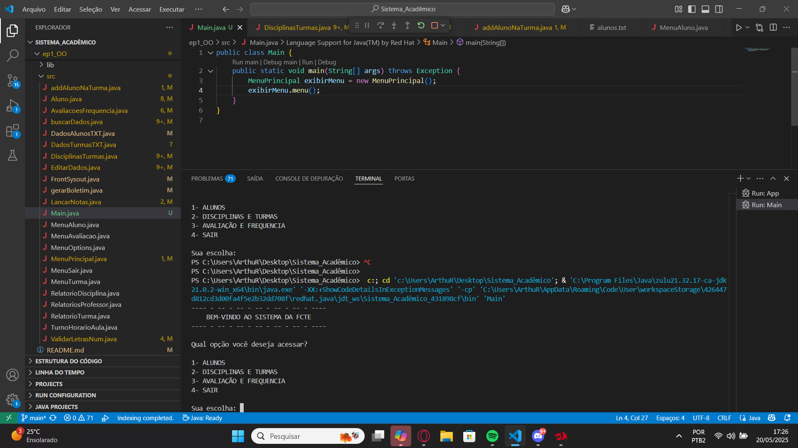
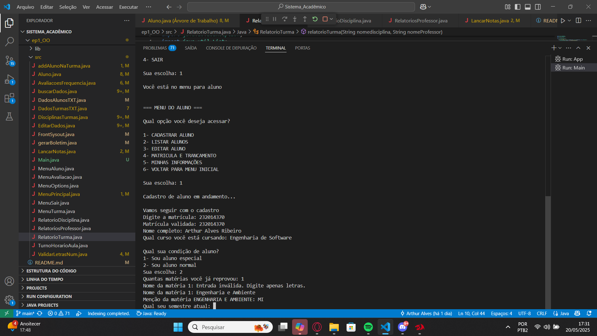

<<<<<<< HEAD
## Getting Started

Welcome to the VS Code Java world. Here is a guideline to help you get started to write Java code in Visual Studio Code.

## Folder Structure

The workspace contains two folders by default, where:

- `src`: the folder to maintain sources
- `lib`: the folder to maintain dependencies

Meanwhile, the compiled output files will be generated in the `bin` folder by default.

> If you want to customize the folder structure, open `.vscode/settings.json` and update the related settings there.

## Dependency Management

The `JAVA PROJECTS` view allows you to manage your dependencies. More details can be found [here](https://github.com/microsoft/vscode-java-dependency#manage-dependencies).
=======
# Sistema Acadêmico - FCTE

## Descrição do Projeto

Desenvolvimento de um sistema acadêmico para gerenciar alunos, disciplinas, professores, turmas, avaliações e frequência, utilizando os conceitos de orientação a objetos (herança, polimorfismo e encapsulamento) e persistência de dados em arquivos.

O enunciado do trabalho pode ser encontrado aqui:
- [Trabalho 1 - Sistema Acadêmico](https://github.com/lboaventura25/OO-T06_2025.1_UnB_FCTE/blob/main/trabalhos/ep1/README.md)

## Dados do Aluno

- **Nome completo:** Arthur Alves Ribeiro
- **Matrícula:** 232014370
- **Curso:** Engenharia de Software
- **Turma:** Turma 06

--- 

## Instruções para Compilação e Execução

1. **Compilação:**  
   Compilação dos arquivos java (todos estão na pasta `src/`):

   javac src/*.java

2. **Execução:**  
   Após a compilação, execute o programa com:

   java -cp src Main

3. **Estrutura de Pastas:**  
   Principais classes: (mais importantes)

   Aluno.java
   AvaliacaoFrequencia.java
   buscarDados.java
   DisciplinasTurmas.java
   EditarDados.java
   LancarNotas.java

   Funcionalidade de cada classe (em ordem alfabética):

   addAlunoNaTurma.java
   Responsável por adicionar um aluno em uma turma específica (escolhida pelo próprio aluno, desde que ele já possua os pré-requisitos necessários).

   Aluno.java
   Cuida do cadastro de alunos, permite a edição de determinadas informações e lista todos os alunos registrados no sistema.

   AvaliacaoFrequencia.java
   Gerencia avaliações, frequências e boletins. Permite o lançamento de notas, geração de boletins e criação de relatórios com base em dados lidos de arquivos .txt.

   buscarDados.java
   Responsável por ler arquivos .txt contendo dados de alunos e professores. Realiza buscas com base em critérios específicos e armazena os resultados em variáveis e listas para uso posterior.

   DadosAlunosTXT.java
   Realiza a criação do arquivo alunos.txt, trata casos de matrícula repetida e cuida da listagem dos alunos.

   DadosTurmasTXT.java
   Gerencia a criação e edição do arquivo turmas.txt. Também edita o número de vagas preenchidas em uma turma e permite a busca por disciplinas específicas.

   DisciplinasTurmas.java
   Gerencia a matrícula em disciplinas, cadastro de novas disciplinas, trancamento/destrancamento de disciplinas e semestres, além da listagem de todas as turmas disponíveis.

   EditarDados.java
   Responsável por editar informações nos arquivos .txt. Realiza alterações como nome e curso do aluno, além de trancamento/destrancamento de semestre e edição de dados no turmas.txt.

   FrontSysout.java
   Responsável por toda a parte visual (menus, navegação textual etc.) utilizando System.out.

   gerarBoletim.java
   Gera o boletim do aluno com base nos dados armazenados, integrando com a classe Aluno.java.

   LancarNotas.java
   Realiza o lançamento de notas, atribui a menção final ao aluno e informa se ele foi aprovado ou reprovado.

   Main.java
   Ponto de entrada do programa. A execução do sistema começa aqui.

   Menu.Aluno.java
   Subclasse de MenuOptions, redireciona o usuário para funcionalidades da classe Aluno.java.

   Menu.Avaliacao.java
   Subclasse de MenuOptions, redireciona o usuário para a classe AvaliacaoFrequencia.java.

   MenuOptions.java
   Classe base com método executar() que é sobrescrito pelas classes de menu.

   MenuPrincipal.java
   Menu principal exibido após o início do programa. Permite o redirecionamento para qualquer funcionalidade desejada.

   MenuSair.java
   Classe responsável por encerrar o programa. Também é uma subclasse de MenuOptions.

   MenuTurma.java
   Subclasse de MenuOptions, redireciona o usuário para a classe DisciplinasTurmas.java.

   RelatorioDisciplina.java
   Gera o relatório de uma disciplina selecionada pelo aluno.

   RelatoriosProfessor.java
   Gera o relatório de um professor selecionado pelo aluno.

   RelatorioTurma.java
   Gera o relatório de uma turma específica escolhida pelo aluno.

   TurnoHorarioAula.java
   Responsável pela edição e formatação do horário das aulas e turnos, seguindo o padrão utilizado na UnB.

   ValidarLetrasNum.java
   Classe utilitária que valida entradas contendo letras, números, salas de aula e matrículas.
   
3. **Versão do JAVA utilizada:**  
   JavaSE-21

---

## Vídeo de Demonstração

- [(https://www.youtube.com/watch?v=_YWXXswWg7A)] Video rodando e explicando o programa

- [(https://www.youtube.com/watch?v=rOnhshaIlVE)] RODANDO TODO O PROGRAMA

## Prints da Execução

1. Menu Principal:  
   

2. Cadastro de Aluno:  
   

3. Relatório de Frequência/Notas:  
   

---

## Principais Funcionalidades Implementadas

- [X] Cadastro, listagem, matrícula e trancamento de alunos (Normais e Especiais)
- [X] Cadastro de disciplinas e criação de turmas (presenciais e remotas)
- [X] Matrícula de alunos em turmas, respeitando vagas e pré-requisitos
- [X] Lançamento de notas e controle de presença
- [X] Cálculo de média final e verificação de aprovação/reprovação
- [X] Relatórios de desempenho acadêmico por aluno, turma e disciplina
- [X] Persistência de dados em arquivos (.txt ou .csv)
- [X] Tratamento de duplicidade de matrículas
- [X] Uso de herança, polimorfismo e encapsulamento

---

## Observações (Extras ou Dificuldades)
   No início do projeto, tive bastante dificuldade por ainda não estar familiarizado com a linguagem Java. Um dos maiores desafios foi trabalhar com arquivos .txt, pois eu não tinha nenhum conhecimento prévio sobre leitura e escrita de arquivos em Java e precisei aprender tudo do zero, por meio de pesquisas e prática.

   Com o tempo, à medida que fui aplicando os conceitos de OO ensinados em sala, percebi como a estruturação do código ficou mais clara e organizada, facilitando bastante o desenvolvimento das funcionalidades. Também implementei alguns tratamentos de exceção ao longo do programa para evitar falhas inesperadas, um exemplo disso pode ser visto na classe ValidarLetrasNum.java, que realiza validações importantes para garantir a integridade dos dados inseridos pelo usuário.

   No geral, foi um projeto desafiador, mas extremamente enriquecedor. Estou satisfeito com o resultado final, sendo bem avaliado ou não, e com tudo o que consegui aprender durante o processo.

## Contato

- email pessoal: arthuralves6622@gmail.com
- email UNB: 232014370@aluno.unb.br
- celular: (61) 99308-3616
>>>>>>> feb74cad779ac50522c638e8c5173a30470cb705
